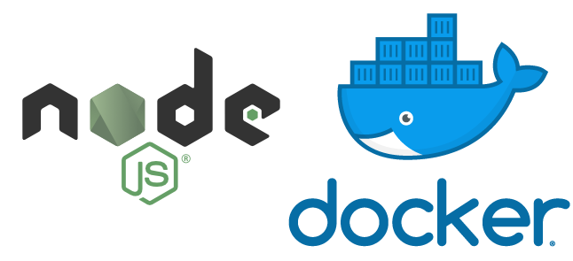

# N.E.D. boilerplate

A simple yet powerful boilerplate for developing modern REST APIs with Node.js & Express 😎



Features:

- **TypeScript**: supported by default (as it should be).
- **Express API**: routes, middlewares, services and configs.
- **Docker**: dockerized development environment + production grade image.
- **Unit tests**: with Jest and Supertest for ease of use.

In order to start developing your REST API simply run:

```bash
source start_dev.sh
```

To build (and push) the production Docker image use:

```bash
docker buildx build --platform linux/arm64 -t <username|organization>/<repository> --push .
```
